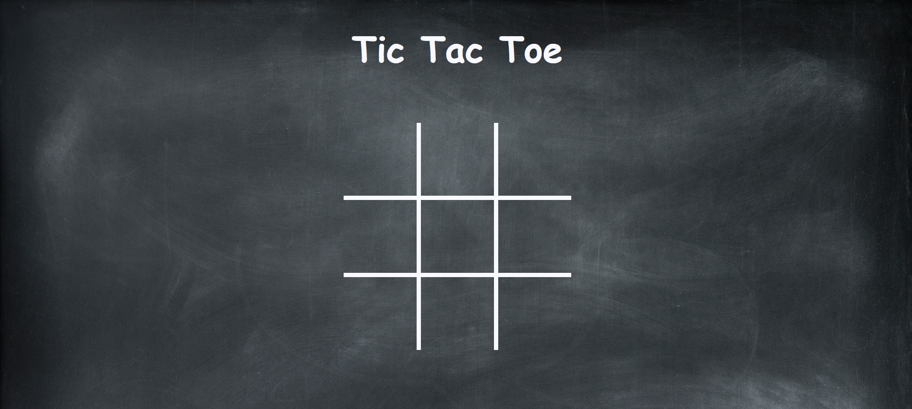

 &nbsp&nbsp&nbsp

# Tic Tac Toe

Proyecto realizado en vanilla JS con el que podrás jugar al juego del 3 en raya compitiendo contra la máquina. Para el comportamiento de la máquina se ha utilizado el algoritmo minimax.

Para los estilos se ha empleado CSS.

## Minimax

¿Qué es el algoritmo minimax? Es un algoritmo recursivo, un método de decisión que minimiza la pérdida máxima esperada en juegos con adversarios. Puedes leer más [aquí](https://es.wikipedia.org/wiki/Minimax)

## Capturas

## Despliegue

Puedes ver el despliegue [aquí](https://sorayaleon.github.io/games/tictactoe/)